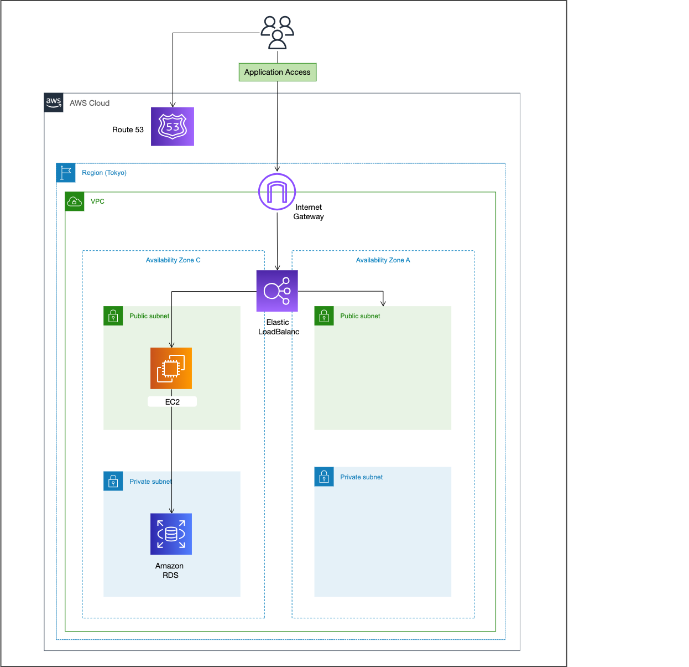

# RealWorld

<details>

<summary><h2>Rails 課題内容</h2></summary>

ステップ1まで実装。

（原文ママ）

ブログプラットフォームを作る [RealWorld](https://github.com/gothinkster/realworld/tree/main) という OSS のプロジェクトがあります。

RealWorld は実世界と同じ機能を持つプラットフォームを作ることで、学習したいフレームワークの技術を習得することを目的としてたプロジェクトです。

ここでは、[RealWorld の バックエンドの API](https://realworld-docs.netlify.app/docs/specs/backend-specs/introduction) の仕様を満たす Rails API を作成します。

ステップ1とステップ2に分かれます。時間に余裕がない場合はステップ1に進んでください。時間に余裕がある場合はステップ2に進んでください。ステップ1を終えてからステップ2に進む設計にはなっていないため、最初にどちらに進むかを選択してください。

ステップ1は RealWorld の API の仕様を部分的に満たした API を作成します。具体的には、認証機能のない簡易バージョンの作成になります。

ステップ2は RealWorld の API の仕様を満たす API を作成します。認証機能付きのバージョンの作成になります。

基本的にはステップ2を進めていくことを想定していますが、時間に余裕がない場合はステップ1を進めてください。

[RealWorld のドキュメント](https://realworld-docs.netlify.app/docs/intro)  に目を通した上で、ステップに進んでください。

## ステップ1
RealWorld　の API のうち、次のエンドポイントを実装してください。

- [Create Article](https://realworld-docs.netlify.app/docs/specs/backend-specs/endpoints#create-article)
- [Get Article](https://realworld-docs.netlify.app/docs/specs/backend-specs/endpoints#get-article)
- [Update Article](https://realworld-docs.netlify.app/docs/specs/backend-specs/endpoints#update-article)
- [Delete Article](https://realworld-docs.netlify.app/docs/specs/backend-specs/endpoints#delete-article)

なお、Article に関わる要素のうち、認証機能及び著者、タグ、お気に入り(favorite) は実装しなくてよいものとします。

</details>


<details>

<summary><h2>デプロイ 課題内容</h2></summary>

（原文ママ）

RealWorld のバックエンドの API を AWS 上にデプロイしましょう。提出は RealWorld の GitHub リポジトリの URL を記載してください。

なお、本クエストは費用がかかるため、メンターからのフィードバック終了後に構築したものは削除することを推奨します。

## ステップ1

RealWorld のバックエンドの API を AWS 上にデプロイしてください。デプロイする際には、次の要件を満たすようにしてください。

- 各エンドポイントに対してリクエストを送ると、正しいレスポンスが返ってくること
- API サーバー (EC2 もしくは ECS) とデータベースサーバー (RDS) は別々に構築すること
- データベースサーバーは、API サーバーからのみアクセスできるようにすること
- 独自ドメインでアクセスできるようにすること
- SSL 化 (HTTPS 化) すること

デプロイできたら、RealWorld の GitHub リポジトリの README にデプロイした URL を記載してください。

なお、独自ドメインは追加取得すると費用がかかるため、今まで学習用に取得した独自ドメインがある場合は、
それを使いまわすと費用が少なくすみます。

## ステップ2

構築したシステムを、インフラ構成図 (AWS のアーキテクチャ図) として draw.io などを用いて描いてください。
描いたインフラ構成図は GitHub のリポジトリ の README もしくは documents ディレクトリにアップしてください。


</details>


<h2>URL</h2>

https://castingmsg.com

CREATE：https://castingmsg.com/api/articles  
GET：https://castingmsg.com/api/articles/:slug  


<details>

<summary><h4>GET 例</h4></summary>

https://castingmsg.com/api/articles/how-to-train-your-dragon

RAWデータで以下のレスポンスが表示されます。

```
{"article":{"slug":"how-to-train-your-dragon","title":"How to train your dragon",
"description":"Ever wonder how?","body":"You have to believe",
"createdAt":"2023-07-05T18:58:55.347Z","updatedAt":"2023-07-05T18:58:55.347Z"}}
```

</details>

UPDATE：https://castingmsg.com/api/articles/:slug  
DELETE：https://castingmsg.com/api/articles/:slug


<details>

<summary><h2>インフラ構成図</h2></summary>



</details>
